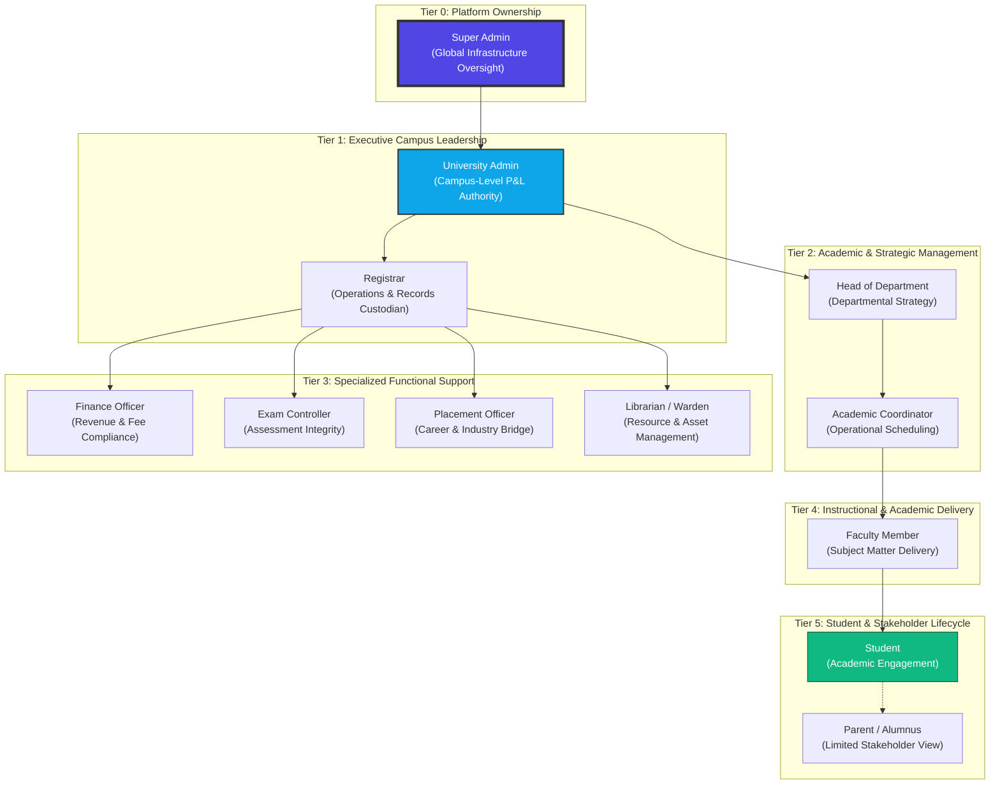

# EduCore ERP: Official Access Control & Governance Manifesto

This document establishes the supreme authority and security protocols for the EduCore ERP system. It defines the hierarchical structure, multi-tenant boundaries, and the proactive security measures that safeguard university data.

---

## 1. Professional Organizational Hierarchy

The system architecture is built on a **6-Tier Authority Model**. Lower tiers are strictly isolated from upper tiers, while permissions flow downwards based on **Rank Inheritance**.

---

## 2. Granular Role Definitions & Authority Ranks

The system uses a **Rank-Based Access Control (RBAC)** model. An endpoint requires a minimum rank, and any user with a rank greater than or equal to that minimum is granted access.

| Authority Tier | Internal Role ID | Rank (0-100) | Scope | Operational Goal |
| :--- | :--- | :---: | :--- | :--- |
| **Global** | `SUPER_ADMIN` | 100 | System-wide | Multi-tenant config & global security auditing. |
| **Executive** | `UNIVERSITY_ADMIN` | 80 | University | Full campus governance and resource allocation. |
| **Executive** | `REGISTRAR` | 70 | University | Management of student lifecycle & statutory records. |
| **Management** | `HOD` | 60 | Department | Academic quality control & departmental oversight. |
| **Functional** | `FINANCE` | 50 | University | Fee optimization & financial transparency. |
| **Functional** | `EXAM_CONTROLLER` | 50 | University | Integrity of assessments and results management. |
| **Academic** | `FACULTY` | 30 | Assigned Courses | Knowledge delivery & student performance tracking. |
| **End User** | `STUDENT` | 10 | Personal Data | Self-service academic & financial participation. |

---

## 3. Implemented Security Infrastructure (What we have done)

We have built a **Defense-in-Depth** architecture that secures data at multiple layers of the stack.

### A. Hierarchical Enforcement (`RolesGuard`)
- **Status**: COMPLETED ✅
- **Details**: Instead of simple role checks, the system performs a rank compare. If an action is marked for `FACULTY (30)`, a `REGISTRAR (70)` or `HOD (60)` can also perform it, reducing administrative bottlenecks while maintaining strict security.

### B. Multi-Tenant University Isolation (`UniversityIsolationGuard`)
- **Status**: COMPLETED ✅
- **Details**: Built into the request lifecycle. It compares the `universityId` in the request parameters/body with the `universityId` in the user's JWT. Any mismatch results in an immediate **403 Forbidden**.

### C. Query-Level Data Shielding (`IsolationInterceptor`)
- **Status**: COMPLETED ✅
- **Details**: A silent interceptor that automatically appends `{ universityId: currentUserId }` to every Mongoose find/update query. This makes "Cross-University Data Leakage" physically impossible at the database driver level.

### D. Universal Audit Trail (`AuditInterceptor`)
- **Status**: COMPLETED ✅
- **Details**: Every write operation (POST, PATCH, DELETE) is logged with a high-fidelity audit trail, including the performing user, the timestamp, the university context, and the full request payload.

---

## 4. Module Access Levels (CRUD-L Matrix)

| Module | Super Admin | Univ. Admin | HOD | Faculty | Student |
| :--- | :---: | :---: | :---: | :---: | :---: |
| **Universities** | CRUD-L | R-L | - | - | - |
| **Departments** | R-L | CRUD-L | R-L | R-L | - |
| **Users / Staff** | CRUD-L | CRUD-L | R-L | - | - |
| **Students** | R-L | CRUD-L | R-L | R-L | R (Own) |
| **Attendance** | R-L | R-L | R-L | CRUD-L | R (Own) |
| **Exams/Marks** | R-L | R-L | RU-L | RU-L | R (Own) |
| **Finances/Fees** | R-L | R-L | - | - | R (Own) |
| **Timetable** | R-L | RU-L | CRUD-L | R-L | R-L |

---

## 5. Visionary Roadmap (What we should add)

To maintain a "Best-in-Class" ERP status, the following features are planned:

### 1. Temporal Administrative Overrides
*   **Concept**: Grant a Faculty member "HOD rank" for a 2-week period (e.g., during departmental leave).
*   **Implementation**: A `PermissionOverride` service that the `RolesGuard` checks before processing the default rank.

### 2. Behavioral Threat Analytics
*   **Concept**: Use the `AuditTrail` to detect suspicious patterns.
*   **Example**: A user deleting 50 records in 1 minute, or a student accessing the Marks update endpoint.
*   **Implementation**: A background worker that uses the existing `AuditLogs` for anomaly detection.

### 3. Session Fingerprinting
*   **Concept**: Bind a JWT to a specific IP or DeviceID.
*   **Implementation**: Enhanced authentication logic that includes a `clientId` check in the `JwtAuthGuard`.

---
> **Note**: This document is the source of truth for all security reviews. Any new feature must be evaluated against this hierarchical rank system to ensure consistency.